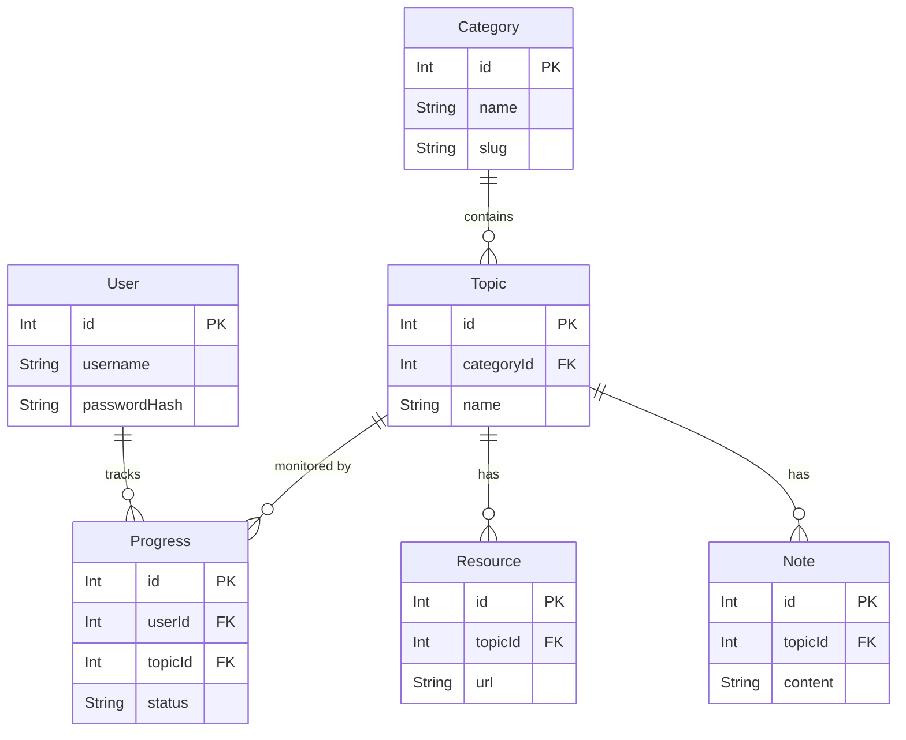

# Database Entity-Relationship Diagram (ERD)

The application uses PostgreSQL with Prisma as the ORM. The schema is designed with security and data persistence in mind, specifically utilizing `Restrict` deletion rather than `Cascade` to prevent accidental data loss.

## ERD Diagram

## Foreign Key Behaviors
- **`onDelete: Restrict`**: Unlike standard CRUD applications that use `Cascade`, we strictly use `Restrict` for all relations.
- **Why?**: A learning tracker's value is in its historical data. If a `Category` or `User` is deleted, we must explicitly handle the cascading effects in the application logic rather than allowing the database to silently wipe out a user's learning progress or notes.
