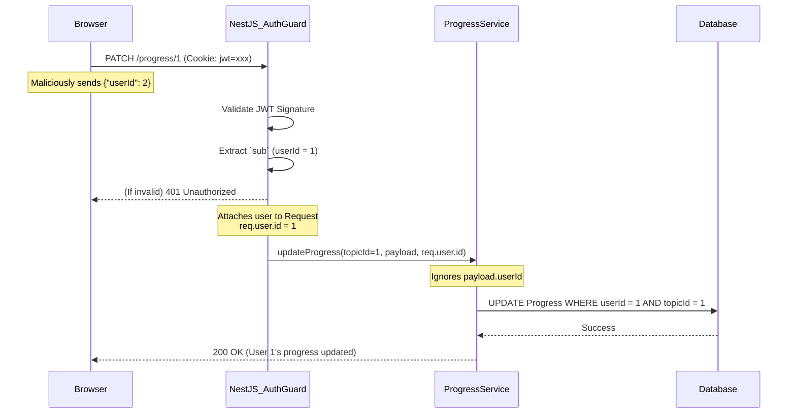

# Authentication & Request Flow

The application enforces a strict **User Isolation** policy by relying exclusively on server-side session identification via HttpOnly cookies.

## Flow Diagram

## Security Invariants
1. **No Client-side Identity Trust**: The frontend is never trusted to identify who is making the request. `userId` in the request body is stripped and ignored by DTO Validation Pipes.
2. **HttpOnly Storage**: The JWT is never accessible to JavaScript (no `localStorage`). This mitigates the risk of token exfiltration via XSS.
