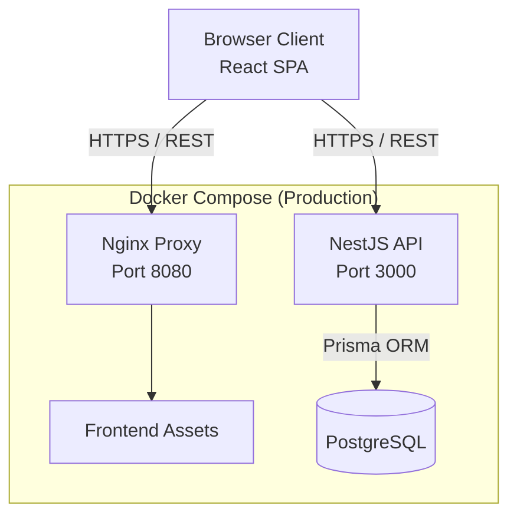
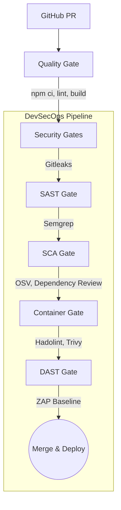

# System Architecture

The DevSecOps Learning Tracker follows a standard modern web application architecture, bolstered by an automated DevSecOps pipeline.

## High-Level Architecture

## Security Pipeline Flow

